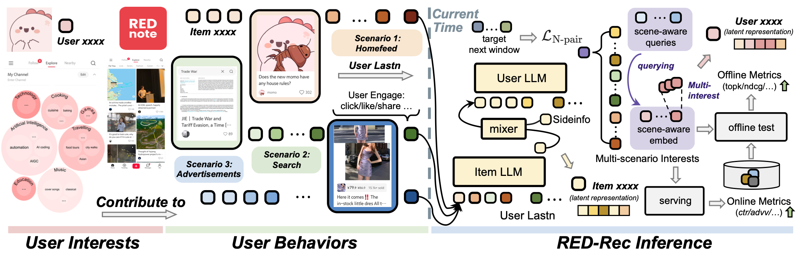

## Cross-Scenario Unified Modeling of User Interests at Billion Scale  



https://arxiv.org/abs/2510.14788

This repository contains the Qwen-adapted implementation, tested on the Qwen 2.5 series. It achieves stable convergence and demonstrates superior performance compared to the Llama version under identical training steps.

## Model and Data
### **Model:** 
Modelscope: [Red-MMU-Rec-Multiscene-Qwen2.5-1.5b](https://modelscope.cn/models/xumanjie/Red-Mmu-Rec-Multiscene-Qwen2.5-1.5b)   
Huggingface: [Red-MMU-Rec-Multiscene-Qwen2.5-1.5b](https://huggingface.co/RedMMURec/Red-Mmu-Rec-Multiscene-Qwen2.5-1.5b)  
(Apache License Version 2.0)

### **Data:** 
Modelscope: [Red-MMU-Data](https://modelscope.cn/datasets/xumanjie/Red-MMU-Data)  
Huggingface: [Red-MMU-Data](https://huggingface.co/datasets/RedMMURec/Red-MMU-Data)
- Training Data: 
Contains large-scale user–item interaction histories collected from 1.08 million users, including `note_embeddings` and `multiscene_lastn` parquet files for pretraining and fine-tuning multimodal recommendation models. (CC BY-NC-ND 4.0)

- Test Data: Includes user_embedding, item_embedding, and user_lastn.json for evaluation. (CC BY-NC-ND 4.0)
Includes `user_embedding`, `item_embedding`, and `user_lastn.json` (CC BY-NC-ND 4.0).

### Training Data: 

1. note_embeddings

| Column              | Type          | Description                                                                                               |
| ------------------- | ------------- | --------------------------------------------------------------------------------------------------------- |
| `encrypted_note_id` | `string`      | Hashed unique identifier of a note.                                                                       |
| `note_idx`          | `int64`       | Numerical index used for cross-referencing.                                                               |
| `note_feature`      | `list<float>` | Embedding vector (64D) representing the note’s latent semantics or visual-textual features. |

2. multiscene_lastn

| Column              | Type           | Description                                               |
| ------------------- | -------------- | --------------------------------------------------------- |
| `encrypted_user_id` | `string`       | Hashed user identifier.                                   |
| `user_idx`          | `int64`        | Integer index of the user.                                |
| `homefeed_list`     | `list<struct>` | Sequence of interactions in homefeed context. |
| `ads_list`          | `list<struct>` | Sequence of interactions with ads.            |

note_idx serves as the join key between note_embeddings and both lists (homefeed_list / ads_list). 

#### Test Data:

Includes user_embedding, item_embedding, and user_lastn.json for evaluation. (CC BY-NC-ND 4.0)
Includes `user_embedding`, `item_embedding`, and `user_lastn.json`.

Due to company policy, we can only open-source a small portion of the notes from Xiaohongshu; specifically, all notes in the test set (~0.8 million) are publicly available, and you can view each note at https://www.xiaohongshu.com/explore/{note_id}
, while the remaining notes in the training data are released as their semantic embeddings only.


## Replicating the Results

1. Download the pretrained checkpoints (`pre_trained_ckpts`) and data files as listed above.
2. Place all the files under the `eval` folder. The folder structure should be like: 

    ```text
    eval/
    ├── emb/
    │   └── demo_multiscene/
    │       ├── base_item_embedding_pr.pkl
    │       ├── lastn_item_embedding_pr.pkl
    │       └── user_embedding_pr.pkl
    ├── pre_trained_ckpts/
    │   ├── Red-Mmu-Rec-Multiscene-Qwen2.5-1.5b
    │   └── Qwen2.5-1.5B
    └── user_lastn.json
    ```
3. Run the evaluation script:

    ```bash
    python eval.py --tag_name demo_multiscene
    ```

The results from this repository may be slightly higher than those reported in the original paper, as outdated records have been removed from the recall pool.

## Further Instructions
### 0: Environment Setup
1. docker：cuda12.4-ofed5.8-nccl2.20.5-torch2.3-2.5
2. `pip install -r requirements.txt`

### 1: Training
```shell
bash start_train.sh [args]
```
### 2: Debugging
```shell
DEBUG=1 bash start_train.sh [args]
```

### 3: Testing
Before testing, update the eval section in the config file.

- model_path: Path to model you’re using
- user_eval.user_lastn_feature_root: Path to lastn features

#### Step 1: Extract lastn note features
```shell
cd eval
python generate_lastn_item_embedding.py --config_path xxx --world_size 4 --global_shift 0 --global_rank 0
```

#### step-2: Extract base pool note embeddings
```shell
cd eval
python generate_base_item_embedding.py  --config_path xxx --world_size 4 --global_shift 0 --global_rank 0 
```

#### step-3: Extract user embeddings
(Download the lastn features locally first)

```shell
cd eval
python generate_user_embedding.py  --config_path xxx --gpu_id 0
```

##### Evaluation script
```shell
cd eval
bash eval.sh
```

You can replicate our results in the paper through our pretrained models and embeddings. Download them from []() and run 'bash eval.sh', you should see results like:

```
Processed 7811 user embeddings
Processed 778111 note embeddings
Note embedding shape: torch.Size([778111, 64])
Valid users for evaluation: 7811
Batch processing: 100%|█████████████████████████████████████████████████████████████████████████████████████████████████████████████████████████████████████████████████████████████| 31/31 [00:02<00:00, 11.82it/s]
------- Compatible Optimized Results -------
Total valid users: 7811
NDCG@10: 0.0180
NDCG@100: 0.0386
NDCG@1000: 0.0653
HR@10: 0.0699
HR@100: 0.2310
HR@1000: 0.5033
MRR: 0.0304
```

## Reference
https://github.com/bytedance/HLLM  
https://github.com/meta-recsys/generative-recommenders  
https://github.com/QwenLM/Qwen  

## Cite Us
```text
@article{xu2025cross,
  title={Cross-Scenario Unified Modeling of User Interests at Billion Scale},
  author={Xu, Manjie and Chen, Cheng and Jia, Xin and Zhou, Jingyi and Wu, Yongji and Wang, Zejian and Zhang, Chi and Zuo, Kai and Chen, Yibo and Tang, Xu and Hu, Yao and Zhu, Yixin},
  journal={arXiv preprint arXiv:2510.14788},
  year={2025}
}
```
